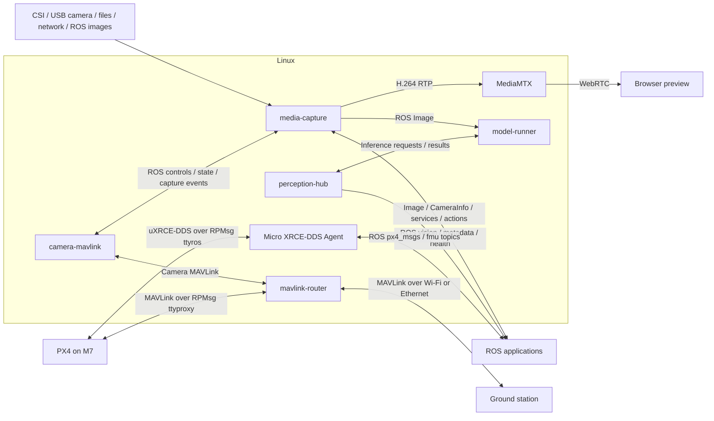

# Components

```mermaid
flowchart LR
    source[CSI / USB camera / files / network / ROS images] --> media
    subgraph linux[Linux]
        media[media-capture]
        camera[camera-mavlink]
        video[MediaMTX]
        runner[model-runner]
        perception[perception-hub]
        agent[Micro XRCE-DDS Agent]
        router[mavlink-router]
        camera <-->|ROS controls / state / capture events| media
        camera <-->|Camera MAVLink| router
        media -->|H.264 RTP| video
        media -->|ROS Image| runner
        perception <-->|Inference requests / results| runner
    end
    video -->|WebRTC| browser[Browser preview]
    media <-->|Image / CameraInfo / services / actions| ros[ROS applications]
    perception -->|ROS vision / metadata / health| ros
    px4[PX4 on M7] <-->|uXRCE-DDS over RPMsg ttyros| agent
    agent <-->|ROS px4_msgs / fmu topics| ros
    px4 <-->|MAVLink over RPMsg ttyproxy| router
    router <-->|MAVLink over Wi-Fi or Ethernet| gcs[Ground station]
```
