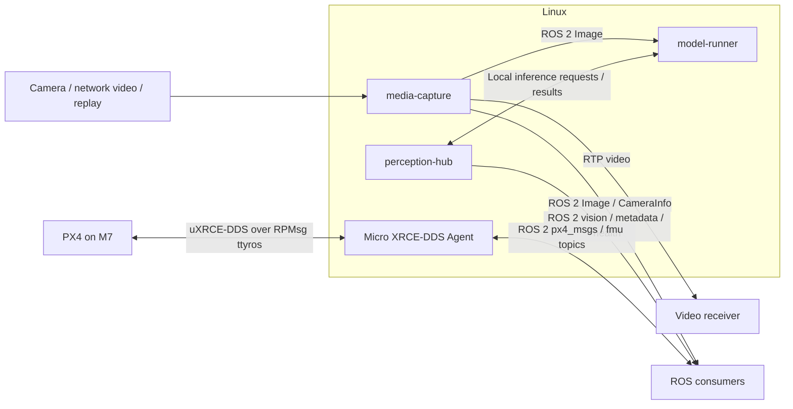

# Components

```mermaid
flowchart LR
    source[Camera / network video / replay] --> media
    media -->|RTP video| receiver[Video receiver]
    media -->|ROS 2 Image / CameraInfo| ros

    subgraph linux[Linux]
        media[media-capture]
        runner[model-runner]
        perception[perception-hub]
        agent[Micro XRCE-DDS Agent]
        media -->|ROS 2 Image| runner
        perception <-->|Local inference requests / results| runner
    end

    perception -->|ROS 2 vision / metadata / health| ros[ROS consumers]
    px4[PX4 on M7] <-->|uXRCE-DDS over RPMsg ttyros| agent
    agent <-->|ROS 2 px4_msgs / fmu topics| ros
```
